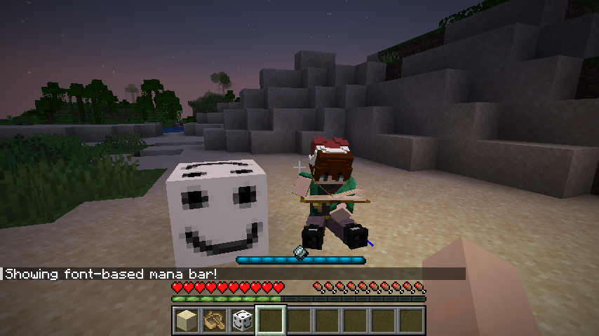
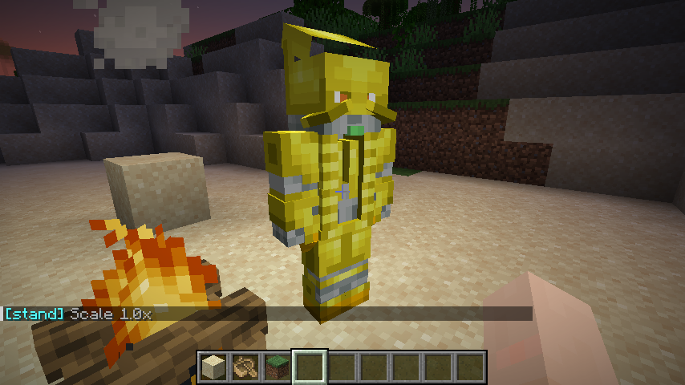

# Krimson

A library for creating custom blocks in a Spigot/Paper-based Minecraft server environment.

Future library to add UI, custom blocks, custom models + animations + sounds with BDEngine, sounds and more!

The goal of this API is to be fully extendable and customizable to your usage, and always free!
Any contribution is welcome!

## Showcases

---

## License

Apache License 2.0 — see [LICENSE](./LICENSE).